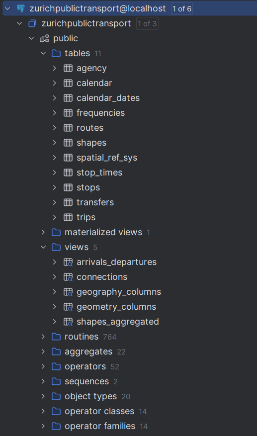

# Public transport in Zurich using MobilityDB

## 1. Load GTFS Scheduled Data in PostgresSQL

### Step 1 – Download the GTFS Scheduled Data zip file

Download the official Zurich timetable GTFS Scheduled data for 2025 from:

👉 [Zurich GTFS 2025 Timetable](https://data.stadt-zuerich.ch/dataset/vbz_fahrplandaten_gtfs/resource/4aa1c6c4-acc3-4b61-8fe7-221b3bd2fd03)

### Step 2 – Unzip file

Inside the `scheduled/data` folder, unzip the previously downloaded `.zip` file. This will generate a new folder containing several `.txt` files, such as:

- `agency.txt`
- `stops.txt`
- `routes.txt`
- `trips.txt`
- `stop_times.txt`
- `calendar.txt`
- `calendar_dates.txt`
- `transfers.txt`
- etc.

Each of these files contains structured information used to define how scheduled trips are organized and operated.

> [!TIP]
> After unzipping, move all the `.txt` files **directly** into the `scheduled/data` folder. Do **not** leave them inside the subfolder that was automatically created during extraction.

### Step 3 - Load data using [`gtfs-via-postgres`](https://github.com/public-transport/gtfs-via-postgres) tool

This tool imports GTFS Scheduled datasets into a PostgreSQL database. The are several ways to install it.

You can run:
```bash
npm install -g gtfs-via-postgres
```

There are also [prebuilt binaries](https://github.com/public-transport/gtfs-via-postgres/releases/tag/4.10.3) and [Docker images](https://github.com/public-transport/gtfs-via-postgres/pkgs/container/gtfs-via-postgres) available.

> [!NOTE]
> This tool needs PostgreSQL >=14 to work. Additionally, PostGIS must be installed in the PostgreSQL server (using StackBuilder), and the operation must be performed using a PostgreSQL superuser (e.g., the postgres user).

Assuming you installed the tool using `npm`, run the following commands depending on your OS:

```bash
# Windows
> cd scheduled
> Set-ExecutionPolicy -Scope Process -ExecutionPolicy Bypass
> .\load_gtfs_data.ps1

# Linux/macOS
> cd scheduled
> npm exec -- gtfs-to-sql --require-dependencies -- data/*.txt | sponge | psql -b
```

This will take a while, but it will generate one table per GTFS file, along with several predefined views specified in the [Getting Started section of the tool's README](https://github.com/public-transport/gtfs-via-postgres/blob/main/readme.md#getting-started).

<p align="center">
  
</p>

<p align="center"><i>
Figure 1: Database created with its corresponding tables and autogenerated views using the GTFS import tool.
</i></p>
